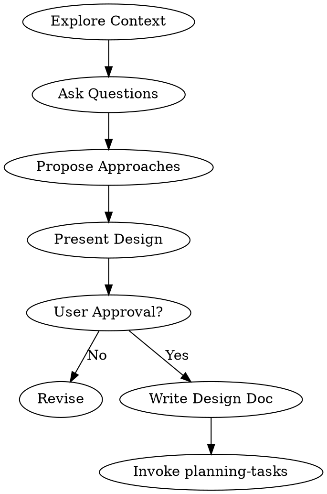

# Brainstorming Ideas Into Designs

## When to use this skill
- Before starting any new feature or component.
- When requirements are vague or high-level.
- When the user asks "How should I build X?"
- **HARD GATE:** You MUST use this before writing implementation code for non-trivial tasks.

## Workflow
1.  **Context**: Check recent commits, docs, and project structure.
2.  **Clarify**: Ask questions *one at a time* to refine requirements.
3.  **Propose**: Offer 2-3 approaches with trade-offs.
4.  **Validate**: Present the design in sections and get approval for each.
5.  **Document**: Write the agreed design to `docs/plans/YYYY-MM-DD-<topic>-design.md`.
6.  **Transition**: Invoke `planning-tasks` to create the implementation plan.

## Process Flow

## Instructions

### 1. Understanding the Idea
*   **One Question Rule:** Ask only one clarifying question per turn. Do not overwhelm the user.
*   **Multiple Choice:** Prefer offering A/B/C options over open-ended "What do you want?" questions.
*   **Focus:** Identify purpose, constraints, and success criteria.

### 2. Exploring Approaches
*   Always propose at least **two** ways to solve the problem (e.g., "Quick & Dirty" vs. "Robust & Scalable").
*   List pros/cons for each.
*   State your recommendation clearly.

### 3. Presenting the Design
*   Break the design into digestable sections (Architecture, Components, meaningful code snippets).
*   **Anti-Pattern:** Do not dump a 500-line spec in one go.

### 4. Output
*   Create a design document in `docs/plans/`.
*   **Do NOT** start coding until the user explicitly approves the design.
*   **Do NOT** use `planning-tasks` until the design is approved.
